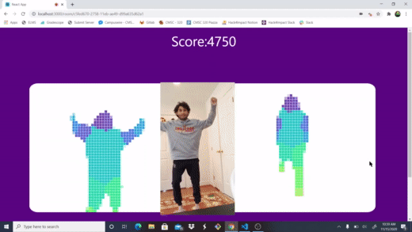

# **Wiggl** -  It's time to get loose 💃🏿
## [Devpost Submission for HackUMBC 2020!](https://devpost.com/software/wiggl?ref_content=user-portfolio) 
## Take any video of someone dancing and plays a multiplayer dancing game!

## [Here it is in action!](https://youtu.be/xdlS_C8mrzA)





# How it works
Using Pose Net from Tensorflow, we were able to take a video feed and compute the location of a human body in the shot. With this, we are able to compare live feed from a webcam with a video of a professional (or amazing amatuer) dancing. Written in JavaSCript with a NodeJS backend and a ReactJS frontend.

# Requirements
- Node
# How to run
For package requirements you must run `npm install` in the `Wiggl` root dir and the `client` dir.

Then run in the root dir run node on the server.js file:

```
node server.js
```
Then in another terminal, enter the client dir and run via npm
```
cd client
npm run start
```
The app will automatically open locally in your web browser. It is located at [localhost:3000](localhost:3000).

# How to change dance video
Must be an mp4 video linked from imgur.com .


In the `Room.js` file located at `Wiggl/client/src/routes/Room.js`, change the `src` variable to equal the link (make sure the link ends in .mp4).
```
...
const v3 = (
    <video
      autoPlay
      loop
      id="dance_hidden"
      src="https://i.imgur.com/MCB77Uw.mp4" //HERE
      style={{ display: "none" }}
      crossOrigin="Anonymous"
    />
  );
...
```
# TODO
- Add larger multiplayer functionality
- Optimze processing of poses
- Improve mobile layout